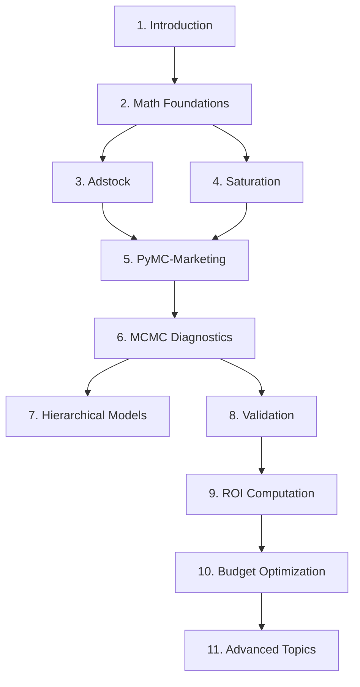

# Executive Summary

## Purpose of This Material

This educational material provides a comprehensive, graduate-level introduction to Bayesian Marketing Mix Modeling (MMM). It is designed to equip data scientists and marketing analysts with both the theoretical foundations and practical implementation skills needed to measure advertising ROI and optimize budget allocation.

---

## Learning Objectives

By completing this material, you will be able to:

1. **Explain** the core concepts of Marketing Mix Modeling and how it differs from attribution
2. **Apply** Bayesian inference principles to marketing measurement problems
3. **Implement** adstock and saturation transformations to model carryover and diminishing returns
4. **Build** MMM models using PyMC-Marketing with proper MCMC diagnostics
5. **Extend** to hierarchical models for multi-region analysis
6. **Validate** model performance using temporal holdout and posterior predictive checks
7. **Compute** channel ROI with uncertainty quantification
8. **Optimize** budget allocation using response curves

---

## Material Structure

---

## Prerequisites

| Topic | Level Required | Recommended Resource |
|-------|----------------|---------------------|
| Python | Intermediate | [Python for Data Science](https://jakevdp.github.io/PythonDataScienceHandbook/) |
| Pandas | Basic | [Pandas User Guide](https://pandas.pydata.org/docs/user_guide/) |
| Statistics | Undergraduate | [Think Stats](https://greenteapress.com/thinkstats/) |
| Linear Regression | Basic | Khan Academy or equivalent |

---

## Suggested Timeline

| Section | Estimated Time | Focus |
|---------|----------------|-------|
| 0-1 | 1 hour | Conceptual overview |
| 2 | 2 hours | Mathematical foundations |
| 3-4 | 1.5 hours | Transformations |
| 5-6 | 2 hours | Implementation |
| 7-8 | 2 hours | Advanced modeling |
| 9-10 | 1.5 hours | Business application |
| 11 | 1 hour | Extensions |

**Total: ~11 hours**

---

## Connection to Project

This material is designed alongside the [MMM-Figshare-eCommerce](../../README.md) project, which implements these concepts using:

- **Dataset**: Multi-region eCommerce data (19 territories, 9 marketing channels)
- **Channels**: Google (Search, Shopping, PMax), Meta (Facebook, Instagram), TikTok
- **Models**: Ridge Regression baseline + Bayesian hierarchical (PyMC-Marketing 0.8+)
- **Dashboard**: Streamlit app with 6 pages (Executive Summary, Budget Optimization, Regional Analysis, Model Comparison, Project Value)
- **Execution**: Local CPU or Google Colab with GPU acceleration

> **Tip**: Run `streamlit run app/dashboard.py` to explore model results interactively.
