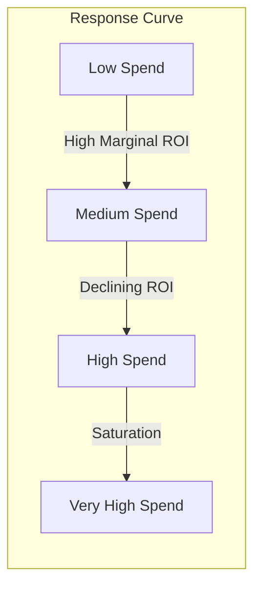

# Saturation Functions

## Diminishing Returns

As advertising spend increases, the incremental response decreases. The first dollar spent is more effective than the millionth dollar. This phenomenon is called **saturation** or **diminishing returns**.

---

## Why Saturation Matters

Without saturation:

- Linear relationship assumed (unrealistic)
- Infinite returns at infinite spend
- Overestimation of high-spend channel effectiveness

With saturation:

- Realistic diminishing returns
- Identifies optimal spend levels
- Better budget allocation decisions

---

## Logistic Saturation

The most common saturation function in MMM. PyMC-Marketing uses the exponential saturation form.

### Formula (Exponential Saturation)

```
f(x) = 1 - exp(-λ × x)
```

Where:

- `x` = adstocked spend (normalized)
- `λ` = saturation rate parameter (controls steepness)

> **Note**: This is equivalent to `LogisticSaturation` in PyMC-Marketing. The name "logistic" refers to the S-curve shape, but the implementation uses the exponential form for numerical stability.

### Alternative Form (Generalized Logistic)

The full logistic function with upper bound L:

```
f(x) = L / (1 + exp(-k × (x - x₀)))
```

Where L is the maximum response, k controls steepness, and x₀ is the inflection point.

### Properties

| λ Value | Saturation Speed | Interpretation |
|---------|------------------|----------------|
| 0.001 | Very slow | Far from saturation |
| 0.01 | Slow | Gradual saturation |
| 0.1 | Moderate | Typical range |
| 1.0 | Fast | Quick saturation |

---

## Hill Function

Alternative saturation based on pharmacology.

### Formula

```
f(x) = x^S / (K^S + x^S)
```

Where:

- `S` = slope (steepness)
- `K` = half-saturation point (EC50)

### Interpretation

- At x = K: Response = K^S / (K^S + K^S) = K^S / (2K^S) = **0.5** (50% of max)
- As x → ∞: Response → x^S / x^S = **1.0** (maximum)
- Higher S: Steeper transition from 0 to 1
- Lower K: Faster saturation (50% point at lower spend)

> **Note**: The Hill function is bounded between 0 and 1. To scale to revenue, multiply by maximum response: Response = R_max × x^S / (K^S + x^S)

---

## Michaelis-Menten

Special case of Hill function (S = 1).

### Formula

```
f(x) = x / (K + x)
```

### Properties

- Linear at low spend
- Approaches 1 asymptotically
- Single parameter (K)

---

## Comparing Saturation Functions

| Function | Parameters | Shape | Use Case |
|----------|------------|-------|----------|
| Logistic | 1-2 | S-curve | General purpose |
| Hill | 2 | Flexible S-curve | Pharma-inspired |
| Michaelis-Menten | 1 | Hyperbolic | Simple, interpretable |
| Power | 1 | Monotonic | No upper bound |

---

## Saturation in the MMM Context

### Combined Transformation

The full channel transformation:

```
Channel Effect = β × Saturation(Adstock(Spend))
```

Sequence:

1. Raw spend
2. Adstock transformation (carryover)
3. Saturation transformation (diminishing returns)
4. Coefficient scaling (β)

### Response Curves

A response curve plots spend against expected response:

```
Response(Spend) = β × Saturation(Adstock(Spend))
```

Used for:

- Visualizing channel efficiency
- Identifying optimal spend levels
- Budget allocation decisions

---

## Implementation in PyMC-Marketing

```python
from pymc_marketing.mmm import LogisticSaturation

saturation = LogisticSaturation()
```

Parameters:

- `lam` prior: HalfNormal(1) by default
- Learned per channel during fitting

---

## Marginal vs Average ROI

### Average ROI

```
Average ROI = Total Response / Total Spend
```

### Marginal ROI

```
Marginal ROI = dResponse / dSpend
```

Due to saturation:

- Marginal ROI < Average ROI (at high spend)
- Marginal ROI determines optimal allocation

### Example

| Spend Level | Marginal ROI | Average ROI |
|-------------|--------------|-------------|
| $100K | 3.0 | 3.0 |
| $500K | 2.0 | 2.5 |
| $1M | 1.0 | 2.0 |
| $2M | 0.3 | 1.5 |

---

## Finding Optimal Spend

### Theoretical Optimum

Where marginal ROI equals 1 (break-even):

```
dResponse / dSpend = 1
```

### Constrained Optimization

Given total budget B, allocate across n channels to maximize total response:

```text
max Σ_i Response_i(Spend_i)
s.t. Σ_i Spend_i = B
     Spend_i ≥ 0 for all i
```

**Solution via Lagrangian:**

Form the Lagrangian:

```text
L = Σ_i Response_i(Spend_i) - μ(Σ_i Spend_i - B)
```

First-order conditions (KKT):

```text
∂L/∂Spend_i = 0 ⇒ ∂Response_i/∂Spend_i = μ  for all i
```

**Interpretation**: At the optimum, **marginal response is equal across all channels**. The Lagrange multiplier μ is the shadow price of budget—the value of one additional dollar.

> This is why we equalize marginal (not average) ROI when optimizing allocation.

---

## Saturation by Channel Type

### Typical Patterns

| Channel Type | Saturation | Rationale |
|--------------|------------|-----------|
| Brand TV | Low | Large reach, slow saturation |
| Paid Search | High | Limited search volume |
| Social | Medium | Audience overlap |
| Display | Medium-High | Banner blindness |
| Email | High | List size limit |

### Implications

- High-saturation channels: Quickly hit diminishing returns
- Low-saturation channels: More room for scale

---

## Visualization

### Response Curve (Conceptual)

The response curve shows diminishing returns:



### Key Visual Patterns

| Spend Level | Curve Behavior | Marginal Response |
|-------------|----------------|-------------------|
| Low | Steep, linear-like | High |
| Medium | Curving, slowing | Moderate |
| High | Flattening | Low |
| Very High | Nearly horizontal | Near zero |

---

## Common Pitfalls

### 1. Same Saturation for All Channels

Different channels saturate at different rates. Allow per-channel parameters.

### 2. Ignoring Saturation

Leads to linear extrapolation and overestimation of high-spend effectiveness.

### 3. Over-parameterization

Too many saturation parameters can lead to identifiability issues.

### 4. Confusing Saturation with Adstock

- Adstock: Temporal spreading of effects
- Saturation: Diminishing returns at higher levels

---

## References

- Jin, Y., et al. (2017). Bayesian Methods for Media Mix Modeling with Carryover and Shape Effects.
- Chan, D., & Perry, M. (2017). Challenges and Opportunities in Media Mix Modeling.
