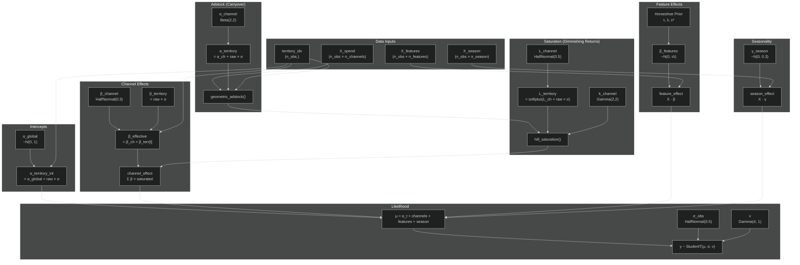

# Hierarchical MMM - Model Architecture

## Dependency Diagram



## Model Equation

```
y[i] = α_territory[t(i)]
     + Σ_c (β_channel[c] + β_territory[t,c]) × Hill(Adstock(X[i,c], α[t,c]), L[t,c], k[c])
     + X_features[i] · β_features
     + X_season[i] · γ_season
     + ε

Where:
  i = observation index
  t = territory of observation i
  c = channel index
  Hill(x, L, k) = x^k / (L^k + x^k)
  Adstock(x, α) = x[t] + α × Adstock(x[t-1], α)
```

## Key Priors Summary

| Component  | Parameter | Prior           | Interpretation              |
| ---------- | --------- | --------------- | --------------------------- |
| Adstock    | α         | Beta(2,2)       | Decay ~0.5, carryover weeks |
| Saturation | L         | HalfNormal(0.5) | Half-saturation point       |
| Saturation | k         | Gamma(2,2)      | Curve steepness             |
| Channels   | β         | HalfNormal(0.3) | Revenue impact (positive)   |
| Features   | β         | Horseshoe       | Sparse, regularized         |
| Likelihood | ν         | Gamma(4,1)      | Outlier robustness          |
