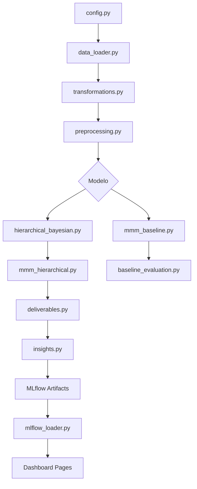

# Roteiro de Leitura do Projeto MMM

Ordem recomendada para compreensão completa do projeto, do início ao fim.

---

## Fase 1: Contexto e Configuração

| #   | Arquivo                                                                   | Objetivo                                   |
| --- | ------------------------------------------------------------------------- | ------------------------------------------ |
| 1   | [README.md](file:///d:/Projects/MMM-Figshare-eCommerce/README.md)         | Visão geral, motivação, resultados         |
| 2   | [CHANGELOG.md](file:///d:/Projects/MMM-Figshare-eCommerce/CHANGELOG.md)   | Histórico de correções e decisões técnicas |
| 3   | [src/config.py](file:///d:/Projects/MMM-Figshare-eCommerce/src/config.py) | Constantes, priors, hiperparâmetros        |

---

## Fase 2: Dados (ETL)

| #   | Arquivo                                                                                     | Objetivo                                                 |
| --- | ------------------------------------------------------------------------------------------- | -------------------------------------------------------- |
| 4   | [src/data_loader.py](file:///d:/Projects/MMM-Figshare-eCommerce/src/data_loader.py)         | Carregamento do parquet, filtragem                       |
| 5   | [src/preprocessing.py](file:///d:/Projects/MMM-Figshare-eCommerce/src/preprocessing.py)     | **Orquestrador**: Pipelines de dados e validação (Split) |
| 6   | [src/transformations.py](file:///d:/Projects/MMM-Figshare-eCommerce/src/transformations.py) | Matemática pura (Adstock, Hill) de baixo nível           |

---

## Fase 3: Modelagem

| #   | Arquivo                                                                                                               | Objetivo                                                |
| --- | --------------------------------------------------------------------------------------------------------------------- | ------------------------------------------------------- |
| 7   | [src/models/hierarchical_bayesian.py](file:///d:/Projects/MMM-Figshare-eCommerce/src/models/hierarchical_bayesian.py) | Modelo PyMC: priors, likelihood, hierarquia territorial |
| 8   | [scripts/mmm_baseline.py](file:///d:/Projects/MMM-Figshare-eCommerce/scripts/mmm_baseline.py)                         | Ridge Regression baseline + grid search                 |
| 9   | [scripts/mmm_hierarchical.py](file:///d:/Projects/MMM-Figshare-eCommerce/scripts/mmm_hierarchical.py)                 | Pipeline completo do modelo hierárquico                 |

---

## Fase 4: Avaliação e Insights

| #   | Arquivo                                                                                                               | Objetivo                                          |
| --- | --------------------------------------------------------------------------------------------------------------------- | ------------------------------------------------- |
| 10  | [src/baseline_evaluation.py](file:///d:/Projects/MMM-Figshare-eCommerce/src/baseline_evaluation.py)                   | Métricas (R², MAPE), cálculo de ROI para baseline |
| 11  | [src/insights.py](file:///d:/Projects/MMM-Figshare-eCommerce/src/insights.py)                                         | Logging de artefatos, curvas de saturação, otim.  |
| 12  | [src/deliverables.py](file:///d:/Projects/MMM-Figshare-eCommerce/src/deliverables.py)                                 | **NOVO**: Geração de deliverables para dashboard  |
| 13  | [src/utils/pymc_marketing_helpers.py](file:///d:/Projects/MMM-Figshare-eCommerce/src/utils/pymc_marketing_helpers.py) | Helpers Standard API (pymc-marketing MMM)         |
| 14  | [src/comparison.py](file:///d:/Projects/MMM-Figshare-eCommerce/src/comparison.py)                                     | Comparação baseline vs hierárquico                |

---

## Fase 5: Orquestração

| #   | Arquivo                                                                                       | Objetivo                                              |
| --- | --------------------------------------------------------------------------------------------- | ----------------------------------------------------- |
| 15  | [src/pipeline.py](file:///d:/Projects/MMM-Figshare-eCommerce/src/pipeline.py)                 | Orquestrador de etapas (LOAD → DELIVERABLES → EXPORT) |
| 16  | [scripts/run_pipeline.py](file:///d:/Projects/MMM-Figshare-eCommerce/scripts/run_pipeline.py) | CLI para executar o pipeline                          |

> **Nota:** Use `--deliverables-only` para regenerar deliverables sem re-treinar.

---

## Fase 6: Dashboard (Streamlit)

| #   | Arquivo                                                                                                                 | Objetivo                                      |
| --- | ----------------------------------------------------------------------------------------------------------------------- | --------------------------------------------- |
| 17  | [app/mlflow_loader.py](file:///d:/Projects/MMM-Figshare-eCommerce/app/mlflow_loader.py)                                 | **Adapter Layer**: Mapeia artefatos do MLflow |
| 18  | [app/shared.py](file:///d:/Projects/MMM-Figshare-eCommerce/app/shared.py)                                               | Sidebar compartilhada, seletor de runs        |
| 19  | [app/components/kpi_cards.py](file:///d:/Projects/MMM-Figshare-eCommerce/app/components/kpi_cards.py)                   | Componentes de KPI                            |
| 20  | [app/components/charts.py](file:///d:/Projects/MMM-Figshare-eCommerce/app/components/charts.py)                         | Gráficos Plotly                               |
| 21  | [app/Home.py](file:///d:/Projects/MMM-Figshare-eCommerce/app/Home.py)                                                   | Página inicial                                |
| 22  | [app/pages/01_Performance_Analysis.py](file:///d:/Projects/MMM-Figshare-eCommerce/app/pages/01_Performance_Analysis.py) | KPIs, ROI, contribuições, alertas             |
| 23  | [app/pages/02_Budget_Optimization.py](file:///d:/Projects/MMM-Figshare-eCommerce/app/pages/02_Budget_Optimization.py)   | Otimização de budget                          |
| 24  | [app/pages/03_What_If_Simulator.py](file:///d:/Projects/MMM-Figshare-eCommerce/app/pages/03_What_If_Simulator.py)       | Simulação interativa de budget                |
| 25  | [app/pages/04_Technical_Details.py](file:///d:/Projects/MMM-Figshare-eCommerce/app/pages/04_Technical_Details.py)       | Parâmetros, comparação, diagnósticos          |
| 26  | [app/pages/05_Historical_Tracking.py](file:///d:/Projects/MMM-Figshare-eCommerce/app/pages/05_Historical_Tracking.py)   | Tendências de ROI, benchmarks históricos      |

---

## Fase 7: Testes e Schemas

| #   | Arquivo                                                                                               | Objetivo                            |
| --- | ----------------------------------------------------------------------------------------------------- | ----------------------------------- |
| 27  | [src/schemas.py](file:///d:/Projects/MMM-Figshare-eCommerce/src/schemas.py)                           | Validação Pydantic dos deliverables |
| 28  | [tests/test_roi.py](file:///d:/Projects/MMM-Figshare-eCommerce/tests/test_roi.py)                     | Testes unitários do cálculo de ROI  |
| 29  | [tests/test_marginal_roas.py](file:///d:/Projects/MMM-Figshare-eCommerce/tests/test_marginal_roas.py) | **NOVO**: Testes de marginal ROAS   |
| 30  | [tests/test_preprocessing.py](file:///d:/Projects/MMM-Figshare-eCommerce/tests/test_preprocessing.py) | Testes de adstock/saturação         |
| 31  | [tests/test_horseshoe_tau.py](file:///d:/Projects/MMM-Figshare-eCommerce/tests/test_horseshoe_tau.py) | Testes do prior Horseshoe           |

---

## Diagrama de Fluxo

---

## Tempo Estimado de Leitura

| Fase            | Arquivos | Tempo          |
| --------------- | -------- | -------------- |
| 1. Contexto     | 3        | ~15 min        |
| 2. Dados        | 3        | ~30 min        |
| 3. Modelagem    | 3        | ~60 min        |
| 4. Avaliação    | 5        | ~45 min        |
| 5. Orquestração | 2        | ~15 min        |
| 6. Dashboard    | 10       | ~40 min        |
| 7. Testes       | 5        | ~20 min        |
| **Total**       | **31**   | **~3.5 horas** |
