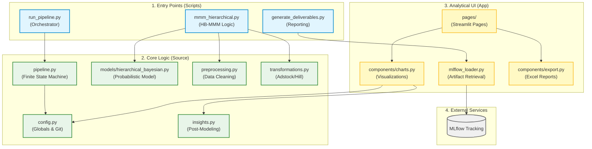

# Repository Architecture Map

This map visualizes the structural relationship between the different modules in the **MMM-Figshare-eCommerce** repository, as indexed by GitNexus.

## System Overview

## Detailed Execution Flows

### 1. Modeling Pipeline (`run_hierarchical`)
The primary flow for training the model:
1. `prepare_hierarchical_data` (scripts/mmm_hierarchical.py)
2. `prepare_weekly_data` (src/preprocessing.py)
3. `log_transform` (src/transformations.py)
4. Model Fitting (Hierarchical Bayesian Model)

### 2. Insight Generation
The flow for extracting value from trained models:
1. `load_artifacts_from_run` (scripts/generate_deliverables.py)
2. `compute_ridge_coefficients` (src/insights.py)
3. `roi_bar_chart` (app/components/charts.py)

---

> [!TIP]
> Use `gitnexus_context({name: "symbol_name"})` for a 360-degree view of any of these components, including all incoming and outgoing references.
